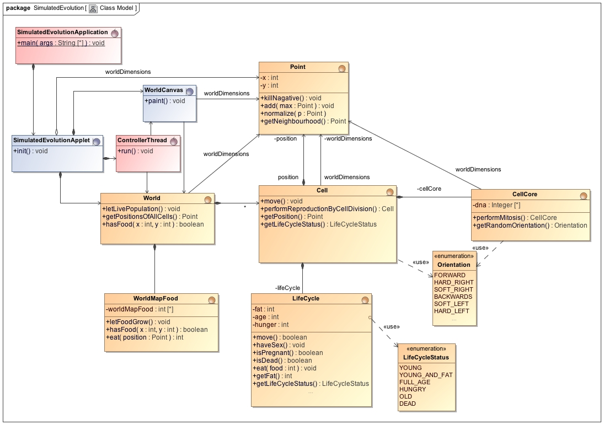

# Simulated Evolution


[](https://travis-ci.com/Computer-Kurzweil/simulated-evolution)

**Artificial Life Simulation of Bacteria Motion depending on DNA**

## Abstract

Green food appears in a simulatedEvolutionModel with red moving cells. These cells eat the food if it is on their position.
Movement of the cells depends on random and their DNA. A fit cell moves around and eats enough to reproduce.
Reproduction is done by splitting the cell and randomly changing the DNA of the two new Cells.
If a cell doesn't eat enough, it will first stand still and after a while it dies.


## Run the Desktop Application

```
git clone https://github.com/Computer-Kurzweil/simulated-evolution.git
cd simulated-evolution
./mvnw
```

## Screenshot


## UML Class Model



## Repositories
* [Github Repository](https://github.com/Computer-Kurzweil/simulated-evolution)
* [Maven Project Reports](https://java.woehlke.org/simulated-evolution/readme2.html)

## Blog Article
[http://thomas-woehlke.blogspot.de/2016/01/simulated-evolution-artificial-life-and.html](http://thomas-woehlke.blogspot.de/2016/01/simulated-evolution-artificial-life-and.html)
