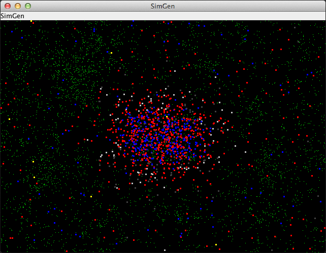
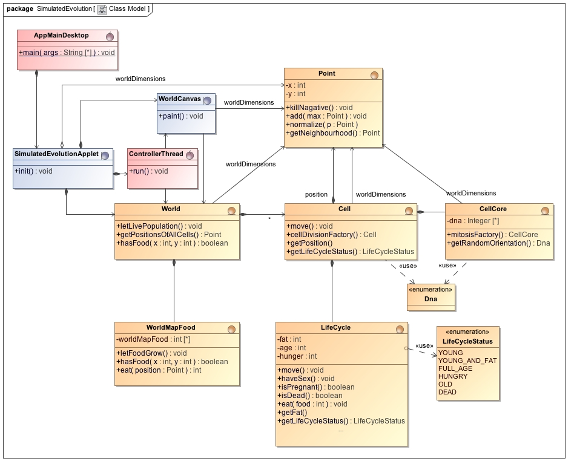

Simulated Evolution
===================

**Artificial Life Simulation of Bacteria Motion depending on DNA**

Abstract
--------

Green food appears in a world with red moving cells. These cells eat the food if it is on their position.
Movement of the cells depends on random and their DNA. A fit cell moves around and eats enough to reproduce.
Reproduction is done by splitting the cell and randomly changing the DNA of the two new Cells.
If a cell doesn't eat enough, it will first stand still and after a while it dies.

Blog Article 
------------
* [http://thomas-woehlke.blogspot.de/2016/01/simulated-evolution-artificial-life-and.html](http://thomas-woehlke.blogspot.de/2016/01/simulated-evolution-artificial-life-and.html)

Screenshot
----------





UML Class Model
---------------




Git Repository
-----------------
* [https://bitbucket.org/ThomasWoehlke/simulated-evolution](https://bitbucket.org/ThomasWoehlke/simulated-evolution)

Project Documentation
---------------------
please visit 

* [https://www.spektrum.de/](https://www.spektrum.de/lp/digital?gclid=EAIaIQobChMIycyDv_Sw3gIVLbHtCh2xWwBgEAAYASAAEgL7HfD_BwE)

Maven Wrapper
-------------
* [https://github.com/takari/maven-wrapper](https://github.com/takari/maven-wrapper) 
* [https://www.baeldung.com/maven-wrapper](https://www.baeldung.com/maven-wrapper) 

Run the Desktop Application
---------------------------

```
git clone https://github.com/phasenraum2010/simulated-evolution.git
cd simulated-evolution
mvnw -Pdefault clean install exec:java
```

Run the Applet Test
-------------------
```
git clone https://github.com/phasenraum2010/simulated-evolution.git
cd simulated-evolution
mvnw -Pdefault clean install exec:java
```


